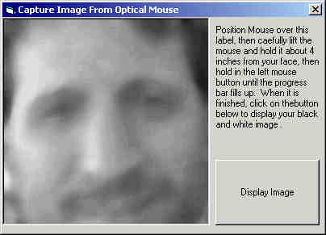



## Optical Mouse Camera

### Description

Use your optical mouse as a camera! Very easy to use, and code is quite simple. Provides greyscale, lowquality, out of focus images, but it's lots of fun. Send it to a friend! It's not a PSC code of the month, but if you want to vote to voice your opinion, go ahead. Please do not look directly into your mouse LED!
 
### More Info
 

             |
---                |---
**Submitted On**   |2002-07-03 11:54:22
**By**             |[Dave Andrews](https://github.com/Planet-Source-Code/PSCIndex/blob/master/ByAuthor/dave-andrews.md)
**Level**          |Intermediate
**User Rating**    |4.2 (247 globes from 59 users)
**Compatibility**  |VB 6\.0
**Category**       |[Jokes/ Humor](https://github.com/Planet-Source-Code/PSCIndex/blob/master/ByCategory/jokes-humor__1-40.md)
**World**          |[Visual Basic](https://github.com/Planet-Source-Code/PSCIndex/blob/master/ByWorld/visual-basic.md)
**Archive File**   |[Optical\_Mo101411732002\.zip](https://github.com/Planet-Source-Code/dave-andrews-optical-mouse-camera__1-36511/archive/master.zip)

